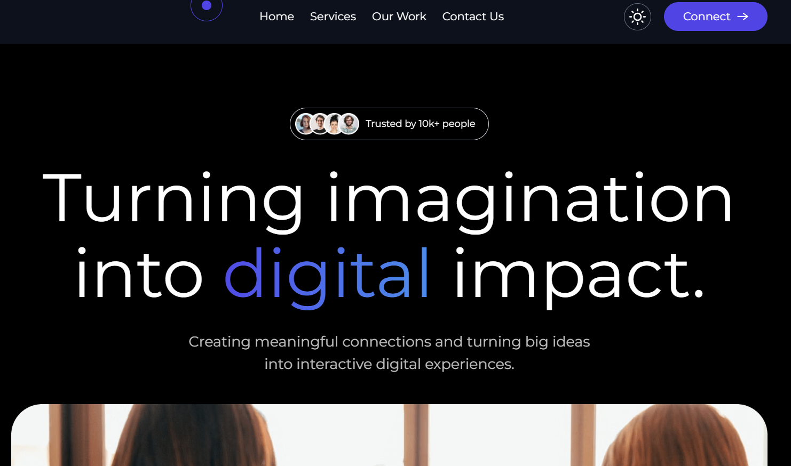

# Agency

A modern, responsive landing page for a marketing agency.  
Built with **React, Vite, Tailwind CSS, and Framer Motion**, this project showcases smooth animations, a clean UI, and a mobile-first design.  

🔗 **Live Demo:** [agency-opal-xi.vercel.app](https://agency-opal-xi.vercel.app)

---

## ✨ Features
- ⚡ Fast development with **Vite**
- 🎨 Stylish and responsive UI with **Tailwind CSS**
- 🎞️ Animations powered by **Framer Motion**
- 📱 Fully responsive (mobile, tablet, desktop)
- 🌐 Easy deployment on **Vercel**

---

## 🛠️ Tech Stack
- **React JS**
- **Vite**
- **Tailwind CSS**
- **Framer Motion**
- **Vercel** (Deployment)

---

## 🚀 Getting Started

Follow these instructions to run the project locally.

### ✅ Prerequisites
- [Node.js](https://nodejs.org/) (v16 or higher recommended)
- npm (comes with Node)

### 📥 Installation
Clone the repository:
```bash
git clone https://github.com/Vivek282002/AGENCY.git
cd AGENCY

```

Install dependencies:
```bash
npm install
```

Start development server:
```bash
npm run dev
```

📸 Screenshots




🙏 Acknowledgments

This project is based on the YouTube tutorial:
How To Build & Deploy Modern Responsive Website Using React JS, Tailwind CSS and Framer Motion

🤝 Contributing

Contributions, issues, and feature requests are welcome!
Feel free to fork this repo and submit a pull request.

📜 License

This project is licensed under the MIT License – feel free to use and modify it.

👤 Author

Vivek

GitHub: @Vivek282002

Live Demo: [agency-opal-xi.vercel.app](https://agency-opal-xi.vercel.app)